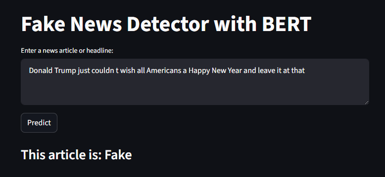

# Fake News Detection

## Overview
This project detects fake news using NLP and transformer models. A `DistilBERT` classifier is trained to distinguish between true and fake news.
Dataset: https://www.kaggle.com/datasets/emineyetm/fake-news-detection-datasets
A Streamlit interface allows users to easily input news text for prediction and get instant classification results.

---

## Features

### NLP Model
- **Model used:** DistilBERT (`DistilBertForSequenceClassification`)  
- **Tokenizer:** DistilBertTokenizerFast  
- **Task:** Binary classification
  - `0` → Fake news  
  - `1` → True news  

### Preprocessing
- Tokenization with padding/truncation to 512 tokens  
- Converts text into input IDs and attention masks for the model  

### Evaluation
- Metrics used: Accuracy, Precision, Recall, F1-score  

---

## Installation
Clone the repository:

```bash
git clone https://github.com/shmahma/FAKE_NEWS
cd FAKE_NEWS
```

### Install dependencies
```bash
pip install -r requirements.txt
```


## Usage

### 1️⃣ Train the Model
```bash
python src/train.py
```
- Loads Fake.csv and True.csv
- Preprocesses the text data
- Fine-tunes DistilBERT for binary classification
- Saves the trained model in models/fake_news_model

### 2️⃣ Predict with Test Data
```bash
python src/predict.py 
```
- Input news text
- Returns "Fake" or "True"
  
### 3️⃣ Streamlit Interface
```bash
python -m streamlit run app.py
```
- Enter news text in the browser
- Get real-time predictions



